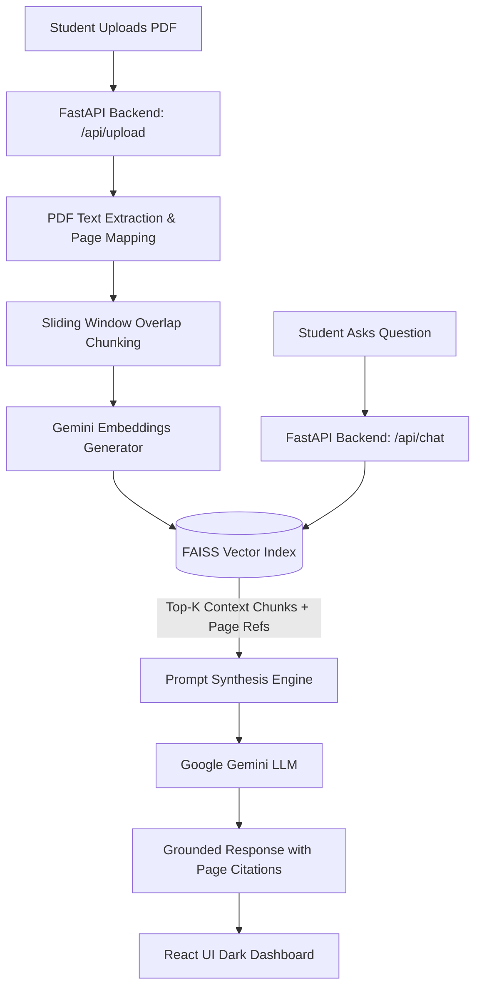

<div align="center">

  <h1>🎓 AI Tutor — Intelligent Textbook Q&A Assistant</h1>
  <p><b>Context-Aware RAG Platform for Academic Textbooks Powered by Google Gemini & FAISS</b></p>

  <p>
    <a href="https://fastapi.tiangolo.com/"></a>
    <a href="https://reactjs.org/"></a>
    <a href="https://vitejs.dev/"></a>
    <a href="https://python.org"></a>
    <a href="https://ai.google.dev/"></a>
    <a href="https://docker.com"></a>
  </p>

  <p>
    <b>Teacher Assessment Tool (TAE-I) — Project-Based Learning</b><br>
    <i>Prepared for:</i> <b>S.B. Jain Institute of Technology, Management and Research, Nagpur</b><br>
    <i>Author:</i> <b>Yogita — B.Tech CSE (2024–2027)</b>
  </p>

</div>

---

## 📌 Executive Summary

**AI Tutor** is a state-of-the-art **Retrieval-Augmented Generation (RAG)** application engineered to assist students in understanding complex academic course materials and textbooks. 

Instead of relying on general internet knowledge or ungrounded AI responses, **AI Tutor** allows students to upload any textbook (PDF format). The platform extracts, chunks, and indexes the material into a high-performance **FAISS Vector Store**. When a student asks a question, the system retrieves exact relevant context from the book and synthesizes grounded explanations with **page-number citations** using **Google Gemini AI**.

---

## ✨ Key Features

- 📄 **PDF Textbook Ingestion**: Intelligent text extraction supporting structural page mapping via `pdfplumber` (with `PyPDF2` fallback).
- 🧩 **Contextual Overlap Chunking**: Smart sliding-window chunking (~1,500 characters per chunk) retaining precise page number metadata.
- ⚡ **FAISS Vector Search**: High-speed vector retrieval index built dynamically per session for strict context-scoped responses.
- 🎯 **Strict Hallucination Prevention**: Prompt-engineered system guardrails that force answers to strictly reference retrieved textbook context with citations (e.g., `[Page 42]`).
- 🎨 **Modern Dark Academic UI**: React interface built with glassmorphism aesthetics, Markdown rendering (`react-markdown`), code syntax highlighting, copy-to-clipboard, and real-time processing indicators.
- 🐳 **Containerized & Production Ready**: Pre-configured with `docker-compose.yml` for unified one-click deployment.

---

## 🏗️ System Architecture



---

## 🛠️ Technology Stack

| Layer | Technologies & Tools |
| :--- | :--- |
| **Frontend UI** | React 18, Vite, Lucide Icons, Axios, React Markdown, Remark GFM, Vanilla CSS (Glassmorphism) |
| **Backend API** | FastAPI, Python 3.11, Uvicorn, Pydantic |
| **RAG & Vector Store** | FAISS (`faiss-cpu`), `pdfplumber`, `PyPDF2`, NumPy |
| **AI / LLM Engine** | Google Gemini (`gemini-1.5-flash`), `google-generativeai` / `google-genai` |
| **DevOps & Hosting** | Docker, Docker Compose, Git, Vercel (Frontend), Render (Backend) |

---

## 📁 Repository Structure

```text
AI-Tutor/
├── backend/
│   ├── app/
│   │   ├── main.py                  # FastAPI server entry point & CORS config
│   │   ├── core/
│   │   │   └── config.py            # Environment configuration & settings
│   │   ├── db/
│   │   │   └── database.py          # Temporary storage initializer
│   │   ├── models/
│   │   │   └── schemas.py           # Pydantic request/response schemas
│   │   ├── routes/
│   │   │   ├── upload.py            # POST /api/upload route handler
│   │   │   └── chat.py              # POST /api/chat & GET /api/health handlers
│   │   └── services/
│   │       ├── ingestion_service.py # PDF parsing & sliding overlap chunker
│   │       ├── vectorstore_service.py # FAISS index build & top-K retriever
│   │       └── llm_service.py       # Gemini API client & RAG prompt builder
│   ├── storage/
│   │   └── uploads/                 # Temporary storage for uploaded PDF files
│   ├── Dockerfile
│   ├── requirements.txt
│   └── .env.example
├── frontend/
│   ├── src/
│   │   ├── components/
│   │   │   ├── UploadBox.jsx        # Drag-and-drop PDF uploader
│   │   │   ├── ChatWindow.jsx       # Chat window container & sample prompts
│   │   │   ├── MessageBubble.jsx    # Formatted Markdown chat bubble with citations
│   │   │   └── InputBox.jsx         # Auto-resizing query input
│   │   ├── pages/
│   │   │   └── Home.jsx             # Main dashboard controller
│   │   ├── services/
│   │   │   └── api.js               # Axios API client wrapper
│   │   ├── App.jsx
│   │   └── main.jsx
│   ├── index.html
│   ├── package.json
│   └── vite.config.js
├── docker-compose.yml
├── .gitignore
└── README.md
```

---

## ⚡ Quickstart & Installation

### Prerequisites
* **Python 3.10 or 3.11**
* **Node.js 18+** & `npm`
* **Google Gemini API Key** (Free from [Google AI Studio](https://aistudio.google.com/))

---

### 1️⃣ Backend Setup

```bash
# 1. Navigate to backend directory
cd backend

# 2. Create and activate a virtual environment
# Windows (PowerShell):
python -m venv venv
.\venv\Scripts\activate

# macOS / Linux:
python3 -m venv venv
source venv/bin/activate

# 3. Install backend dependencies
pip install -r requirements.txt

# 4. Create .env file
cp .env.example .env
# Edit .env and paste your GEMINI_API_KEY="your_api_key_here"

# 5. Launch the FastAPI server
uvicorn app.main:app --reload --port 8000
```
> 📍 **Backend API Base**: `http://localhost:8000`  
> 📑 **Interactive Swagger Docs**: `http://localhost:8000/docs`

---

### 2️⃣ Frontend Setup

Open a **new terminal tab**:

```bash
# 1. Navigate to frontend directory
cd frontend

# 2. Install Node dependencies
npm install

# 3. Start the Vite development server (Windows PowerShell fix included)
npm.cmd run dev
```
> 🎨 **Frontend Web UI**: `http://localhost:5173`

---

### 3️⃣ Running with Docker (Optional)

```bash
# Set your Gemini API Key in your shell
# Windows PowerShell:
$env:GEMINI_API_KEY="your_key_here"

# Linux / macOS:
export GEMINI_API_KEY="your_key_here"

# Spin up both containers
docker-compose up --build
```

---

## 🔌 API Documentation

### `POST /api/upload`
Uploads a textbook PDF and builds a FAISS index.

* **Content-Type**: `multipart/form-data`
* **Body**: `file` (Binary PDF file, max 20MB)
* **Response**:
```json
{
  "session_id": "9b1deb4d-3b7d-4bad-9bdd-2b0d7b3dcb6d",
  "status": "ready",
  "filename": "operating_systems.pdf",
  "total_pages": 42,
  "total_chunks": 118
}
```

### `POST /api/chat`
Sends a query grounded against the uploaded PDF session.

* **Content-Type**: `application/json`
* **Body**:
```json
{
  "session_id": "9b1deb4d-3b7d-4bad-9bdd-2b0d7b3dcb6d",
  "question": "What is deadlocking in process management?"
}
```
* **Response**:
```json
{
  "answer": "Deadlock is a state where a set of processes are blocked because each holds a resource...\n\n**Key Conditions:**\n1. Mutual Exclusion\n2. Hold and Wait [Page 14]",
  "sources": [
    {
      "page": 14,
      "snippet": "A deadlock occurs when processes are unable to proceed..."
    }
  ]
}
```

---

## 🚀 Deployment Guide

| Component | Recommended Host | Quick Setup Steps |
| :--- | :--- | :--- |
| **Frontend** | **Vercel** / Netlify | Root Directory: `frontend` \| Framework: `Vite` \| Env Var: `VITE_API_BASE_URL=https://<your-backend>.onrender.com/api` |
| **Backend** | **Render** / Railway | Root Directory: `backend` \| Build: `pip install -r requirements.txt` \| Start: `uvicorn app.main:app --host 0.0.0.0 --port $PORT` |

---

## 📊 TAE-I Assessment Mapping

| Rubric Criteria | Weightage | Implementation Details |
| :--- | :---: | :--- |
| **Topic Knowledge** | **3 Marks** | Comprehensive SRS, RAG architecture, vector search math, and Gemini LLM grounding. |
| **Development** | **3 Marks** | End-to-end full-stack app with React 18, FastAPI, FAISS vector index, page citations, and error fallbacks. |
| **Presentation** | **2 Marks** | Sleek Dark Glassmorphism UI with interactive PDF dropzone, real-time status indicators, and Markdown rendering. |
| **Documentation** | **2 Marks** | Professional README, detailed installation steps, API specifications, and Docker support. |

---

## 📄 License & Attribution

Developed for **Teacher Assessment Tool (TAE-I)** at **S.B. Jain Institute of Technology, Management and Research, Nagpur**.  
Submitted by: **Yogita — B.Tech CSE (2024–2027)**.
